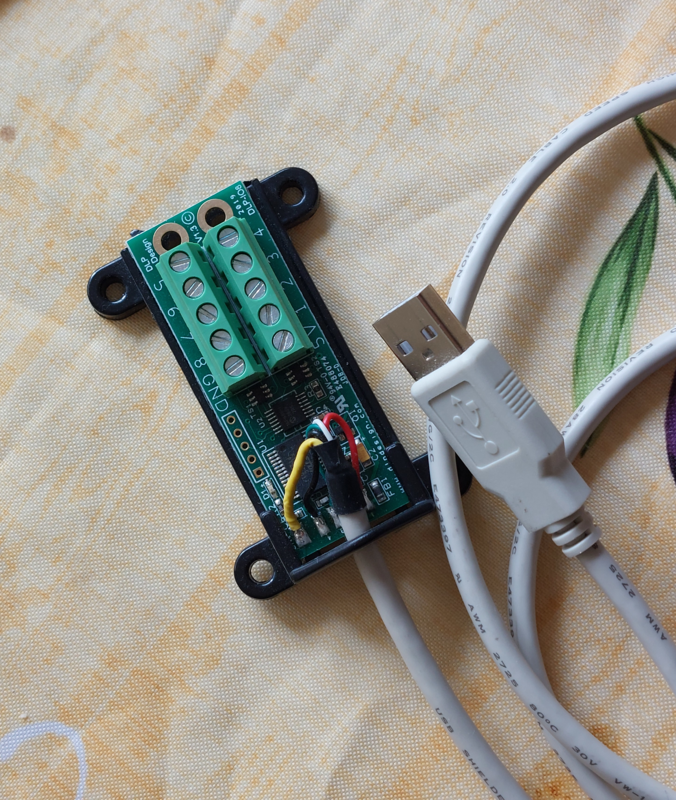

# dlp-io8-g
Python code to control the DLP-IO8-G USB-to-TTL device



The DLP-IO8-G is a simple USB data acquisition module which permits to receive or send TTL signals on 8 lines using a simple serial protocol  (Note that DLP design also manufactures modules with with 14 or 20 lines (see <http://www.dlpdesign.com/usb/>))

It works out of the box under Linux as the FTDI VCP driver is present in the Linux kernel.

Here is the list of commands:

| ASCII |  Hex | Description       | Return                             |
|-------+------+-------------------+------------------------------------|
| 1     | 0x31 | Ch1 Digital Out 1 |                                    |
| Q     | 0x51 | Ch1 Digitil Out 0 |                                    |
| A     | 0x41 | Ch1 Digital In    | 0 or 1                             |
| Z     | 0x5A | Ch1 Analog In     | voltage                            |
| 9     | 0x39 | Ch1 Temperature   |                                    |
| 2     | 0x32 | Ch2 Digital Out 1 |                                    |
| W     | 0x57 | Ch2 Digitil Out 0 |                                    |
| S     | 0x53 | Ch2 Digital In    |                                    |
| X     | 0x58 | Ch2 Analog In     |                                    |
| 0     | 0x30 | Ch2 Temperature   |                                    |
| 3     | 0x33 | Ch3               |                                    |
| E     | 0x45 |                   |                                    |
| D     | 0x44 |                   |                                    |
| C     | 0x43 |                   |                                    |
| -     | 0x2D |                   |                                    |
| 4     | 0x34 | Ch4               |                                    |
| R     | 0x52 |                   |                                    |
| F     | 0x46 |                   |                                    |
| V     | 0x56 |                   |                                    |
| =     | 0x3D |                   |                                    |
| 5     | 0x35 | Ch5               |                                    |
| T     | 0x54 |                   |                                    |
| G     | 0x47 |                   |                                    |
| B     | 0x42 |                   |                                    |
| O     | 0x4F |                   |                                    |
| 6     | 0x36 | Ch6               |                                    |
| Y     | 0x59 |                   |                                    |
| H     | 0x48 |                   |                                    |
| N     | 0x4E |                   |                                    |
| P     | 0x50 |                   |                                    |
| 7     | 0x37 | Ch7               |                                    |
| U     | 0x55 |                   |                                    |
| J     | 0x4A |                   |                                    |
| M     | 0x4D |                   |                                    |
| [     | 0x5B |                   |                                    |
| 8     | 0x38 | Ch8               |                                    |
| I     | 0x49 |                   |                                    |
| K     | 0x4B |                   |                                    |
| ,     | 0x2C |                   |                                    |
| ]     | 0x5D |                   |                                    |
| `     | 0x60 | set ASCII mode    |                                    |
| \     | 0x5C | set BINARY mode   |                                    |
| L     | 0x4C | set °F            |                                    |
| ;     | 0x3B | set °C            |                                    |
| '     | 0x27 | Ping              | Q (0x51) returned if DLP-IO8 is ok |


A full description of the device is available at <http://www.ftdichip.com/Support/Documents/DataSheets/DLP/dlp-io8-ds-v15.pdf>


To use it under Python, you need to install `pyserial`:

     pip install pyserial

Here is an example to send TTL on/off signals on Chanel 1:

```{Python}
from serial import Serial

dlp = Serial(port='/dev/ttyUSB0', baudrate=115200)  # open serial port

ON1 = b'1'
dlp.write(ON1)

OFF1 = b'Q'
delp.write(OFF1)
```
