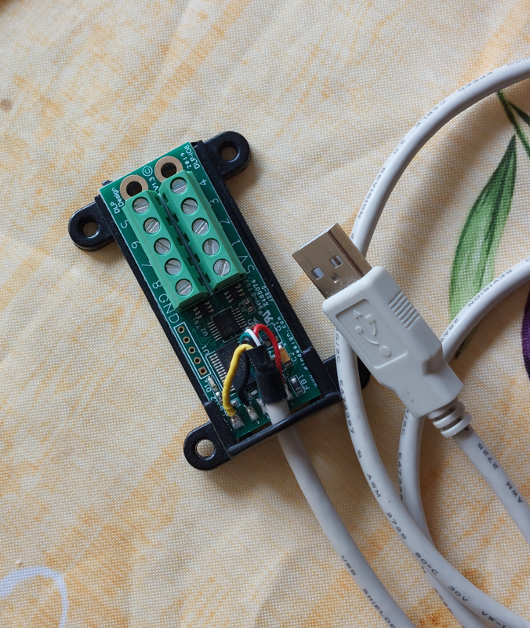
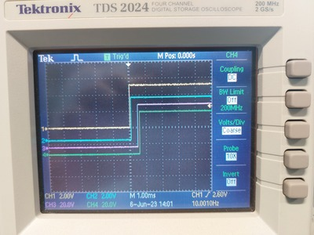
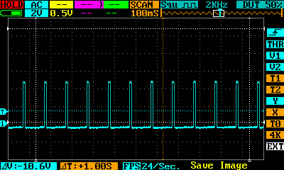

# dlp-io8-g
Code and timing measurements for the DLP-IO8-G USB-to-TTL device: Python and C
clients, and a measurement harness. The Go client lives in its own repository,
[chrplr/dlpio8](https://github.com/chrplr/dlpio8).



The DLP-IO8-G is a simple USB data acquisition module which permits to receive or send TTL signals on 8 lines. From a software point of view, it appears as a serial device which can be controlled by writing and reading characters.

A full description of the device is available at <http://www.ftdichip.com/Support/Documents/DataSheets/DLP/dlp-io8-ds-v15.pdf>

It can be bought, for example, at [rs-online](https://co-en.rs-online.com/product/dlp-design/dlp-io8-g/70372089/)

Note: DLP design also manufactures modules with with 14 or 20 lines (see <http://www.dlpdesign.com/usb/>)

## Full list of commands

Communication with the DLP is handled by sending commands to a  serial device. 

| ASCII |  Hex | Description       | Return                             |
|-------|------|-------------------|------------------------------------|
| 1     | 0x31 | Ch1 Digital Out 1 |                                    |
| Q     | 0x51 | Ch1 Digital Out 0 |                                    |
| A     | 0x41 | Ch1 Digital In    | 0 or 1                             |
| Z     | 0x5A | Ch1 Analog In     | voltage                            |
| 9     | 0x39 | Ch1 Temperature   |                                    |
| 2     | 0x32 | Ch2 Digital Out 1 |                                    |
| W     | 0x57 | Ch2 Digital Out 0 |                                    |
| S     | 0x53 | Ch2 Digital In    |                                    |
| X     | 0x58 | Ch2 Analog In     |                                    |
| 0     | 0x30 | Ch2 Temperature   |                                    |
| 3     | 0x33 | Ch3 Digital Out 1 |                                    |
| E     | 0x45 | Ch3 Digital Out 0 |                                    |
| D     | 0x44 | Ch3 Digital In    |                                    |
| C     | 0x43 | Ch3 Analog In     |                                    |
| -     | 0x2D | Ch3 Temperature   |                                    |
| 4     | 0x34 | Ch4 Digital Out 1 |                                    |
| R     | 0x52 | Ch4 Digital Out 0 |                                    |
| F     | 0x46 | Ch4 Digital In    |                                    |
| V     | 0x56 | Ch4 Analog In     |                                    |
| =     | 0x3D | Ch4 Temperature   |                                    |
| 5     | 0x35 | Ch5 Digital Out 1 |                                    |
| T     | 0x54 | Ch5 Digital Out 0 |                                    |
| G     | 0x47 | Ch5 Digital In    |                                    |
| B     | 0x42 | Ch5 Analog In     |                                    |
| O     | 0x4F | Ch5 Temperature   |                                    |
| 6     | 0x36 | Ch6 Digital Out 1 |                                    |
| Y     | 0x59 | Ch6 Digital Out 0 |                                    |
| H     | 0x48 | Ch6 Digital In    |                                    |
| N     | 0x4E | Ch6 Analog In     |                                    |
| P     | 0x50 | Ch6 Temperature   |                                    |
| 7     | 0x37 | Ch7 Digital Out 1 |                                    |
| U     | 0x55 | Ch7 Digital Out 0 |                                    |
| J     | 0x4A | Ch7 Digital In    |                                    |
| M     | 0x4D | Ch7 Analog In     |                                    |
| [     | 0x5B | Ch7 Temperature   |                                    |
| 8     | 0x38 | Ch8 Digital Out 1 |                                    |
| I     | 0x49 | Ch8 Digital Out 0 |                                    |
| K     | 0x4B | Ch8 Digital In    |                                    |
| ,     | 0x2C | Ch8 Analog In     |                                    |
| ]     | 0x5D | Ch8 Temperature   |                                    |
| `     | 0x60 | set ASCII mode    |                                    |
| \     | 0x5C | set BINARY mode   |                                    |
| L     | 0x4C | set °F            |                                    |
| ;     | 0x3B | set °C            |                                    |
| '     | 0x27 | Ping              | Q (0x51) returned if DLP-IO8 is ok |


## Installation

The DLP-IO8-G relies on the FTDI VCP driver (see <https://ftdichip.com/drivers/vcp-drivers/>).


Under Linux, add yourself to the `tty` and `dialup` groups:

    sudo usermod -a -G tty [yourlogin]
    sudo usermod -a -G dialout [yourlogin]

You may also need to manually load ftdi_sio:

    sudo modprobe ftdi_sio


### Determine the serial port under Linux

Once plugged, to determine the serial port the dlp-io8-g is attached to, type the
command `dmesg` in a Terminal. You should get something like::


    [ 5128.109725] usbcore: registered new interface driver usbserial_generic
    [ 5128.109730] usbserial: USB Serial support registered for generic
    [ 5128.112142] usbcore: registered new interface driver ftdi_sio
    [ 5128.112148] usbserial: USB Serial support registered for FTDI USB Serial Device
    [ 5128.112175] ftdi_sio 1-1:1.0: FTDI USB Serial Device converter detected
    [ 5128.112190] usb 1-1: Detected FT232RL
    [ 5128.113130] usb 1-1: FTDI USB Serial Device converter now attached to ttyUSB0

The last line tells you that the device is at `/dev/ttyUSB0`.


## Python examples

### Example 1

To use it under Python, you need to install `pyserial`:

     pip install pyserial


The following Python code, switches all data lines to 0, then 1, then  0 again, with half second delays.

```python
    from serial import Serial
    from time import sleep
    
    dlp = Serial(port='/dev/ttyUSB0', baudrate=115200)  # open serial port

    dlp.write(b'QWERTYUI')  # sets all lines to '0'
    sleep(0.5)
    dlp.write(b'12345678')  # sets all lines to '1'
    sleep(0.5)
    dlp.write(b'QWERTYUI')  # sets all lines back to '0'
```    

Note: The lines do **not** change together. Each command is a single byte, so the eight
edges are spread over about 610 µs (see [`measurements/`](measurements/) and [Do not send multi-bit codes to a fast
sampler](#do-not-send-multi-bit-codes-to-a-fast-sampler) below.)




### Example 2: Writing on lines 1 to 8

```python
from serial import Serial
dlp = Serial(port='/dev/ttyUSB0', baudrate=115200)  # open serial port

dlp.write(b'QWERTYUI')  # set all lines to '0'
dlp.write(b'12345678')  # set all lines to '1'

ON1 = b'1'
ON2 = b'2'
ON3 = b'3'
ON4 = b'4'
dlp.write(ON1 + ON2 + ON3 + ON4)

OFF1 = b'Q'
OFF2 = b'W'
OFF3 = b'E'
OFF4 = b'R'
dlp.write(OFF1 + OFF2 + OFF3 + OFF4)
```


### Example 3: Detecting changes on input line 1

```python
   import time
   import serial

   dlp = serial.Serial(port='/dev/ttyUSB0', baudrate=115200)  # open serial port
   print(dlp.name)         # check which port was really used
   dlp.write(b'`')  # switch to ascii mode

   start = time.perf_counter()
   previous_state = '2'

   while True:
      dlp.write(b'A')  # request to read line 1
      state = dlp.read(3).decode('utf-8')
      if state[0] != previous_state[0]:
          print(time.perf_counter() - start, state[0])
          previous_state = state

```


### Example 4: Sending pulses at regular intervals

```python

  #! /usr/bin/env python3

   """ Generate a square wave on pin1 of DLP-IO8-G """

   from time import perf_counter 
   from serial import Serial

   dlp = Serial(port='/dev/ttyUSB0', baudrate=115200)  # open serial port
   # byte codes to control line 1:
   ON1 = b'1'
   OFF1 = b'Q'

   # number of periods
   NPERIODS = 1000

   # Timing of the square wave
   TIME_HIGH = 0.010   # 10ms pulse
   TIME_LOW = 0.090    # send every 100ms
   PERIOD = TIME_HIGH + TIME_LOW

   onset_times = [ (PERIOD * i) for i in range(NPERIODS) ]

   i = 0
   while i < NPERIODS:
       if i == 0:
           t0 = perf_counter()

       # wait until the start of the next period
       while perf_counter() - t0 < onset_times[i]:
           None
           
       dlp.write(ON1)
       
       # busy wait for 'TIME_HIGH' seconds. This should be more accurate than time.sleep(TIME_HIGH)
       t1 = perf_counter()
       while perf_counter() - t1 < (TIME_HIGH):
           None
           
       dlp.write(OFF1)
       i = i + 1
       print(f"\r{i:4d}", end='')

   time.sleep(TIME_LOW)
   print()
   print(f'{NPERIODS} periods of {PERIOD} seconds')
   print('Total time-elapsed: ' + str(perf_counter() -t0))
   dlp.close()         # close the port
```

Here is the result on an oscilloscope:


      

## Go

The Go client is a separate module:
**[github.com/chrplr/dlpio8](https://github.com/chrplr/dlpio8)**
([reference](https://pkg.go.dev/github.com/chrplr/dlpio8)).

```bash
go get github.com/chrplr/dlpio8                        # library
go install github.com/chrplr/dlpio8/cmd/dlpio8@latest  # the command
```

It covers the same ground as the Python above, plus a `dlpio8` command for
checking wiring and watching lines without writing a program, and it can set the
FTDI latency timer itself rather than leaving it to a shell command you remember
to run beforehand. Worked examples are in that repository's README; the timing
figures they cite are measured here, in [`measurements/`](measurements/).


## Timing: two things to do before collecting data on Linux

Both were measured on this device; raw data and method in
[`measurements/`](measurements/).

**1. Lower the FTDI latency timer, if you read inputs.** The `ftdi_sio` default
is 16 ms, and it gates every reply: an 8-channel read costs 15.98 ms and a poll
loop runs at 63 Hz. At 1 ms the same read costs 1.01 ms and 995 Hz.

```bash
echo 1 | sudo tee /sys/bus/usb-serial/devices/ttyUSB0/latency_timer
```

That reverts on replug; a udev rule makes it stick:

```
SUBSYSTEM=="usb-serial", DRIVERS=="ftdi_sio", ATTR{latency_timer}="1"
```

It does nothing for *sending* triggers — output latency is USB frame scheduling.

**2. Run the experiment at real-time priority.** With a single line the device
places a pulse within ~20 µs of the request on an idle host, but under CPU load
the median error reaches +1.85 ms with 4.75 ms of spread. That is the host's
scheduler descheduling your process, not the device — the host's own busy-wait
interval degrades identically. Real-time priority removes it:

| host state | median error | spread | n per width |
|---|---|---|---|
| idle | within ±30 µs | ≤ 150 µs | 1000 |
| loaded, normal priority | up to +1.85 ms | up to 4.75 ms | 50 |
| loaded, `chrt -f 50` | +33 to +47 µs | 130–150 µs | 1000 |

```bash
chrt -f 50 ./my-experiment
```

That needs a one-time grant — a file in `/etc/security/limits.d/` giving your
user `rtprio 50`, then a full logout and login. The priority passed to `chrt`
must not exceed the granted value, or it fails with "Operation not permitted".

## Why no absolute latency is quoted here

A natural idea is to measure the round trip — raise a TTL line, read it back, time
the whole thing — and take half. It does not work, and the reason is worth
knowing because it applies to every variant of the idea.

**Every measurement you can make is a sum.** With devices A and B:

    R_AB = out(A) + in(B)          R_AA = out(A) + in(A)
    R_BA = out(B) + in(A)          R_BB = out(B) + in(B)

Four equations, four unknowns — but `R_AB + R_BA = R_AA + R_BB` identically, so
only three are independent. Adding more devices adds more sums, never a
separation. This is the **one-way delay problem** from clock synchronisation:
round-trip time is measurable to arbitrary precision, one-way delay is not
derivable from it without a synchronised clock or independent knowledge of the
asymmetry. It is why NTP assumes symmetry rather than measuring it.

### What a round trip does tell you

It gives an **upper bound**, and that is worth having. Since `R = out + in` and
neither term can be negative, each is at most `R`. Take the smallest round trip
observed, not the median — that is the tightest the data supports:

| `latency_timer` | best round trip | so outbound latency is at most |
|---|---|---|
| 1 ms | 0.793 ms | **0.793 ms** |
| 16 ms | 15.396 ms | 15.396 ms |

Note what sets the tightness: the *return* path. At the driver's default the
bound is 15 ms and tells you essentially nothing. Lowering the latency timer
does not just speed up polling — it sharpens what you can conclude about the
outbound path, which is a second and less obvious reason to set it.

What a round trip cannot do is give you the outbound latency itself, or separate
it from the return.

### Comparing round trips does not help either

The obvious next move is to compare a loopback against a bare poll and attribute
the difference to the outbound path. It does not work: both commands travel the
same path, so a delay common to them appears in both measurements and cancels in
the subtraction. Measured at `latency_timer=1`:

| | median round trip |
|---|---|
| bare poll (ask the device a question) | 0.997 ms |
| loopback (raise a line, poll until it reads high) | 0.996 ms |

Adding the entire outbound trigger to the loop changed the result by
**−0.001 ms**. The difference carries no information about the outbound path —
though, as above, the loopback figure itself still bounds it.

### A tighter bound, without any instrument

Vary the return path by a *known* amount and extrapolate. The FTDI latency timer
does exactly that, and across 1, 2, 4, 8 and 16 ms:

    bare poll  =  0.9984 x latency_timer  -  1.4 us
    loopback   =  0.9994 x latency_timer  -  3.7 us

Slope essentially exactly 1, and **both intercepts within a few microseconds of
zero**. Extrapolating the FTDI batching to nothing, everything else in the loop —
outbound dispatch, device processing, input detection — sums to under ~10 µs.
Since none of those can be negative, that **puts the outbound latency in the tens
of microseconds** — about thirty times tighter than the 0.793 ms above, and not
the ~1 ms that "USB frames are 1 ms" would suggest. Bulk OUT transfers evidently
go out within the current frame rather than waiting for the next.

This is a stronger claim than the plain bound and rests on an assumption the
plain bound does not: that the return path is exactly the timer with no constant
term. So there are three statements available, in decreasing order of certainty
and increasing order of precision:

| claim | rests on |
|---|---|
| outbound latency ≤ 0.793 ms | arithmetic, no assumptions |
| outbound latency ≈ tens of µs | the extrapolation above |
| outbound latency = *x* | not available without a zero-latency host reference |

The middle figure is consistent with a head-to-head against a NeuroSpin MEG TTL
box, which puts the two devices within tens of microseconds of each other. That
comparison bounds the difference but does not resolve it — see
[`measurements/`](measurements/#write-latency-the-difference-is-not-resolved-and-here-is-why)
for why reversing the write order does not cancel the host's contribution here.

### Measuring it properly

It needs something this setup does not have: **an event the host can produce at a
time it knows exactly, visible to the same instrument as the TTL output.** A
parallel-port `outb` is the classic choice — a CPU instruction, so the host knows
when it executed — and a memory-mapped GPIO write on an SBC is equivalent. With
one of those, comparing the two edges on a scope in both orders gives the
absolute figure directly.

A USB protocol analyser would give the device-side half (packet on the wire → TTL
edge) but not the host-side half, since `write()` returns before the packet
leaves. Cheap logic analysers do not qualify: full-speed USB is 12 Mbit/s, so
decoding it needs ~48–96 MS/s, and the common CY7C68013A boards sample at 24.

## Do not send multi-bit codes to a fast sampler

There is no atomic multi-channel write: every command is a single ASCII byte for
one line, so setting an 8-bit code sends eight of them and **the port takes
~610 µs to settle** (86.2 µs per byte, measured n=99). Against a system sampling
at 1 kHz that is about 61 % of a sample period, so a code change is sampled
mid-transition roughly three times in five and recorded as a value that was
never sent.

Use **one line per event type, pulsed**: a single command byte, no skew at all,
and eight lines still distinguish eight event types.


