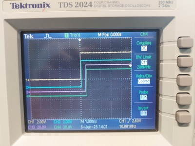

# dlp-io8-g
Python code to control the DLP-IO8-G USB-to-TTL device.


The DLP-IO8-G is a simple USB data acquisition module which permits to receive or send TTL signals on 8 lines using a very simple serial protocol. It relies on the FTDI VCP driver which is present in the standard Linux kernel so that there is not need to install any driver: it works out of the box.

From a software point of view, it appears as a serial device which can be controlled by writing and reading characters.

For example, the following Python code, switches all data lines to 0, then 1, then  0 again, with half second delays.

```
    from serial import Serial
    from time import sleep
    
    dlp = Serial(port='/dev/ttyUSB0', baudrate=115200)  # open serial port

    dlp.write(b'QWERTYUI')  # sets all lines to '0'
    sleep(0.5)
    dlp.write(b'12345678')  # sets all lines to '1'
    sleep(0.5)
    dlp.write(b'QWERTYUI')  # sets all lines back to '0'
```    

The following capture from a scope shows that, at the 115200 baudrate, the delay between the edges of the first and 8th line is less than 1msec. 



Note: DLP design also manufactures modules with with 14 or 20 lines (see <http://www.dlpdesign.com/usb/>)


Here is the full list of commands:

| ASCII |  Hex | Description       | Return                             |
|-------|------|-------------------|------------------------------------|
| 1     | 0x31 | Ch1 Digital Out 1 |                                    |
| Q     | 0x51 | Ch1 Digital Out 0 |                                    |
| A     | 0x41 | Ch1 Digital In    | 0 or 1                             |
| Z     | 0x5A | Ch1 Analog In     | voltage                            |
| 9     | 0x39 | Ch1 Temperature   |                                    |
| 2     | 0x32 | Ch2 Digital Out 1 |                                    |
| W     | 0x57 | Ch2 Digital Out 0 |                                    |
| S     | 0x53 | Ch2 Digital In    |                                    |
| X     | 0x58 | Ch2 Analog In     |                                    |
| 0     | 0x30 | Ch2 Temperature   |                                    |
| 3     | 0x33 | Ch3 Digital Out 1 |                                    |
| E     | 0x45 | Ch3 Digital Out 0 |                                    |
| D     | 0x44 | Ch3 Digital In    |                                    |
| C     | 0x43 | Ch3 Analog In     |                                    |
| -     | 0x2D | Ch3 Temperature   |                                    |
| 4     | 0x34 | Ch4 Digital Out 1 |                                    |
| R     | 0x52 | Ch4 Digital Out 0 |                                    |
| F     | 0x46 | Ch4 Digital In    |                                    |
| V     | 0x56 | Ch4 Analog In     |                                    |
| =     | 0x3D | Ch4 Temperature   |                                    |
| 5     | 0x35 | Ch5 Digital Out 1 |                                    |
| T     | 0x54 | Ch5 Digital Out 0 |                                    |
| G     | 0x47 | Ch5 Digital In    |                                    |
| B     | 0x42 | Ch5 Analog In     |                                    |
| O     | 0x4F | Ch5 Temperature   |                                    |
| 6     | 0x36 | Ch6 Digital Out 1 |                                    |
| Y     | 0x59 | Ch6 Digital Out 0 |                                    |
| H     | 0x48 | Ch6 Digital In    |                                    |
| N     | 0x4E | Ch6 Analog In     |                                    |
| P     | 0x50 | Ch6 Temperature   |                                    |
| 7     | 0x37 | Ch7 Digital Out 1 |                                    |
| U     | 0x55 | Ch7 Digital Out 0 |                                    |
| J     | 0x4A | Ch7 Digital In    |                                    |
| M     | 0x4D | Ch7 Analog In     |                                    |
| [     | 0x5B | Ch7 Temperature   |                                    |
| 8     | 0x38 | Ch8 Digital Out 1 |                                    |
| I     | 0x49 | Ch8 Digital Out 0 |                                    |
| K     | 0x4B | Ch8 Digital In    |                                    |
| ,     | 0x2C | Ch8 Analog In     |                                    |
| ]     | 0x5D | Ch8 Temperature   |                                    |
| `     | 0x60 | set ASCII mode    |                                    |
| \     | 0x5C | set BINARY mode   |                                    |
| L     | 0x4C | set °F            |                                    |
| ;     | 0x3B | set °C            |                                    |
| '     | 0x27 | Ping              | Q (0x51) returned if DLP-IO8 is ok |


A full description of the device is available at <http://www.ftdichip.com/Support/Documents/DataSheets/DLP/dlp-io8-ds-v15.pdf>

## Installation

To use it under Python, you need to install `pyserial`:

     pip install pyserial

Under Linux, add yourself to the `tty` and `dialup` groups:

    sudo usermod -a -G tty [yourlogin]
    sudo usermod -a -G dialout [yourlogin]


## Determine the serial port (Linux)

Once plugged, to determine the serial port the dlp-io8-g is attached to, type the
command `dmesg` in a Terminal. You should get something like::


    [ 5128.109725] usbcore: registered new interface driver usbserial_generic
    [ 5128.109730] usbserial: USB Serial support registered for generic
    [ 5128.112142] usbcore: registered new interface driver ftdi_sio
    [ 5128.112148] usbserial: USB Serial support registered for FTDI USB Serial Device
    [ 5128.112175] ftdi_sio 1-1:1.0: FTDI USB Serial Device converter detected
    [ 5128.112190] usb 1-1: Detected FT232RL
    [ 5128.113130] usb 1-1: FTDI USB Serial Device converter now attached to ttyUSB0

The last line tells you that the device is at `/dev/ttyUSB0`.

## Examples 

### Writing on lines 1 to 8

```python
from serial import Serial
dlp = Serial(port='/dev/ttyUSB0', baudrate=115200)  # open serial port

dlp.write(b'QWERTYUI')  # set all lines to '0'
dlp.write(b'12345678')  # set all lines to '1'

ON1 = b'1'
ON2 = b'2'
ON3 = b'3'
ON4 = b'4'
dlp.write(ON1 + ON2 + ON3 + ON4)

OFF1 = b'Q'
OFF2 = b'W'
OFF3 = b'E'
OFF4 = b'R'
dlp.write(OFF1 + OFF2 + OFF3 + OFF4)
```


### Detecting changes on input line 1

```python
   import time
   import serial

   dlp = serial.Serial(port='/dev/ttyUSB0', baudrate=115200)  # open serial port
   print(dlp.name)         # check which port was really used
   dlp.write(b'`')  # switch to ascii mode

   start = time.perf_counter()
   previous_state = '2'

   while True:
      dlp.write(b'A')  # request to read line 1
      state = dlp.read(3).decode('utf-8')
      if state[0] != previous_state[0]:
          print(time.perf_counter() - start, state[0])
          previous_state = state

```


### Sending pulses at regular intervals

```python

  #! /usr/bin/env python3

   """ Generate a square wave on pin1 of DLP-IO8-G """

   from time import perf_counter 
   from serial import Serial

   dlp = Serial(port='/dev/ttyUSB0', baudrate=115200)  # open serial port
   # byte codes to control line 1:
   ON1 = b'1'
   OFF1 = b'Q'

   # number of periods
   NPERIODS = 1000

   # Timing of the square wave
   TIME_HIGH = 0.010   # 10ms pulse
   TIME_LOW = 0.090    # send every 100ms
   PERIOD = TIME_HIGH + TIME_LOW

   onset_times = [ (PERIOD * i) for i in range(NPERIODS) ]

   i = 0
   while i < NPERIODS:
       if i == 0:
           t0 = perf_counter()

       # wait until the start of the next period
       while perf_counter() - t0 < onset_times[i]:
           None
           
       dlp.write(ON1)
       
       # busy wait for 'TIME_HIGH' seconds. This should be more accurate than time.sleep(TIME_HIGH)
       t1 = perf_counter()
       while perf_counter() - t1 < (TIME_HIGH):
           None
           
       dlp.write(OFF1)
       i = i + 1
       print(f"\r{i:4d}", end='')

   time.sleep(TIME_LOW)
   print()
   print(f'{NPERIODS} periods of {PERIOD} seconds')
   print('Total time-elapsed: ' + str(perf_counter() -t0))
   dlp.close()         # close the port
```

Here is the result on an oscilloscope:


      
